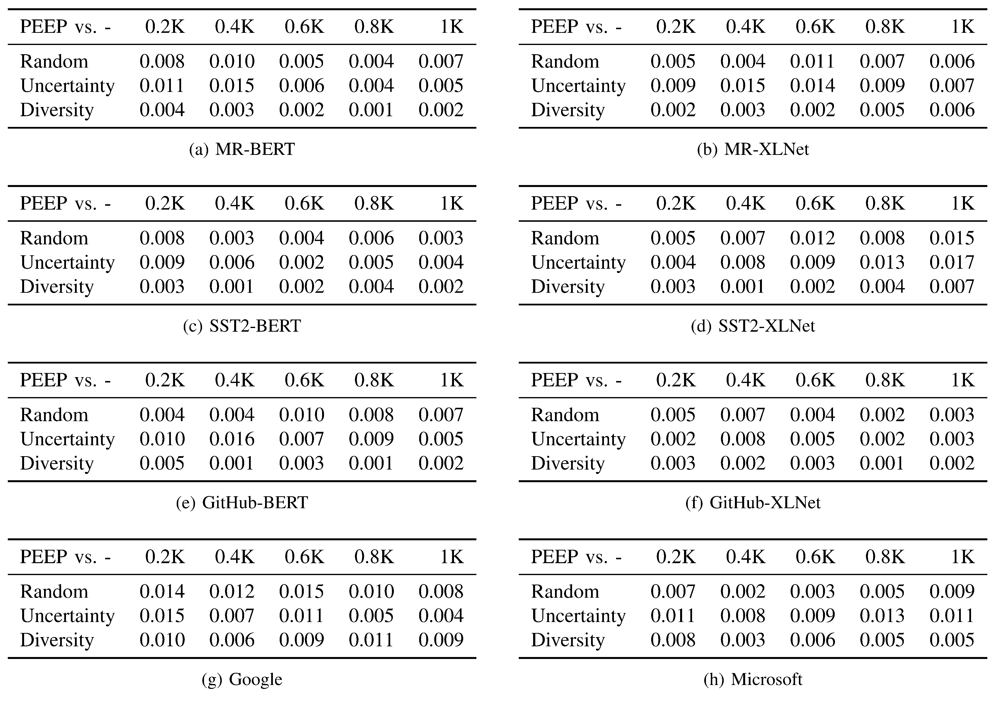

# Practical and Efficient Model Extraction of Sentiment Analysis APIs
Pytorch implementation for the ICSE 2023 paper. In this repository, we release the code for stealing the BERT model trained on the MR dataset. We will release the complete code if this paper gets accepted. 

## Additional Results
**Tests of Statistical Significance**

- The *p*-values of *t*-tests when comparing our method with the state-of-the-art baseline (Random Text) [19], in terms of the design of the proxy training source. The first row reports the victim models/APIs.


- The *p*-values of *t*-tests when comparing our method with different sampling strategies.




## Requirements

- Python 3.6.13
- Cuda 10.2
- Pytorch 1.10.1
- textattack 0.3.0

## Experiments

Install the textattack environment from the website (https://github.com/QData/TextAttack) before running the code, which includes the pre-trained weights and other required packages.

### Introduction

- `wiki_data_sub.tsv` : our proxy training source, i.e., the randomly selected data from the WikiText-103 corpus.

- `bert_mr_predict_wiki.py` : the code for querying the victim model and generating labeled datasets.

- `policy.py` : the implementation of the proposed method to train the extracted model.

- `evaluation.py` : the code for evaluating the extracted model.

  

### Example Usage

#### Generate labeled datasets by querying the victim model


```
python bert_mr_predict_wiki.py
```

#### Train the extracted model


```
python policy.py
```

#### Evaluate the extracted model

```
python evaluation.py
```
